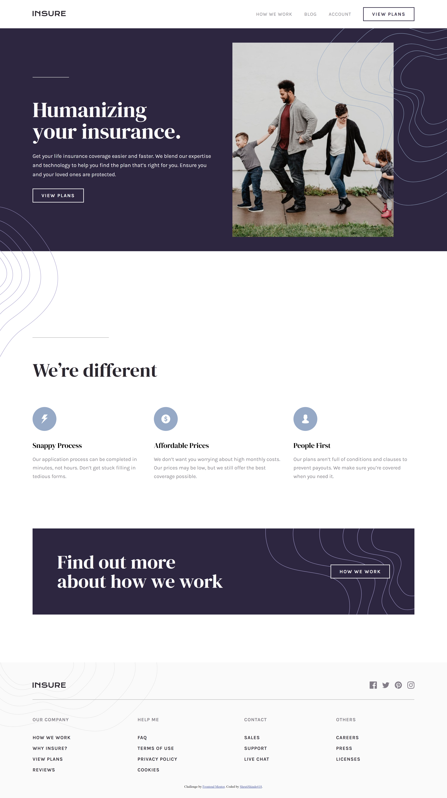

# Frontend Mentor - Insure landing page solution

This is a solution to the [Insure landing page challenge on Frontend Mentor](https://www.frontendmentor.io/challenges/insure-landing-page-uTU68JV8). Frontend Mentor challenges help you improve your coding skills by building realistic projects.

## Table of contents

- [Frontend Mentor - Insure landing page solution](#frontend-mentor---insure-landing-page-solution)
  - [Table of contents](#table-of-contents)
  - [Overview](#overview)
    - [The challenge](#the-challenge)
    - [Screenshot](#screenshot)
    - [Links](#links)
  - [My process](#my-process)
    - [Built with](#built-with)
    - [What I learned](#what-i-learned)
  - [Author](#author)

## Overview

### The challenge

Users should be able to:

- View the optimal layout for the site depending on their device's screen size
- See hover states for all interactive elements on the page

### Screenshot

### Links

- Solution URL: [https://github.com/ShrutiShinde418/FrontendMentor5/tree/main/insure-landing-page](https://github.com/ShrutiShinde418/FrontendMentor5/tree/main/insure-landing-page)
- Live Site URL: [https://insure-landing-page-five-iota.vercel.app/](https://insure-landing-page-five-iota.vercel.app/)

## My process

### Built with

- Semantic HTML5 markup
- LESS CSS Preprocessor
- Flexbox
- CSS Grid

### What I learned

- LESS
- How to make a hamburger menu and an offcanvas.

## Author

- Frontend Mentor - [@ShrutiShinde418](https://www.frontendmentor.io/profile/ShrutiShinde418)
